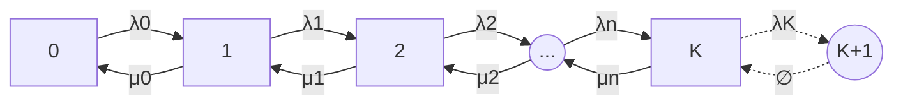

## Problem Statement

### Definition

The M/M/1/K model represents a system comprised of a single server managing a queue of arriving packets. 

The notation "M/M/1/K" stands for:
- a Markovian arrival process
- a Markovian service process
- a single server
- K indicates the system's maximum capacity

In this model, packets arrive at a rate that follows a Poisson distribution, and the service time for each packet is exponentially distributed. 

A key characteristic is the queue's maximum capacity, set at $$ K $$ packets. 

Any packets arriving when the queue is full are immediately discarded. 

> This model is especially useful for analyzing systems constrained by a finite-sized buffer.
{: .prompt-info }

### Notations

In the context of the M/M/1/K model, we define the following:

- $$ K $$: The maximum number of states the queue can take, which corresponds to the number of messages stored. This is determined by $$ D $$, the message size, and $$ B $$, the buffer size.
- $$ \eta $$ : The utilization factor of the system, calculated as the ratio between the arrival rate $$ \lambda $$, i.e., the number of elements received over a specified duration, and the service rate $$ \mu $$, i.e., the number of elements processed in the same duration. Both $$ \lambda $$ and $$ \mu $$ follow a Poisson process.

A utilization factor $$ \eta < 1$$ indicates **underutilization**, with a correspondingly low probability of packet discarding. 

Conversely, $$ \eta \geq 1 $$ signifies **full utilization**, where the likelihood of packet discard increases significantly as the buffer nears its capacity.

The system's dynamics can be depicted by a Markov Chain with $$ K $$ states, each representing the queue's message count at any given time. We introduce the following notations:

- $$ \pi_n $$: The probability of the system being in state $$ n $$, with $$ n $$ messages in the queue, at a random time.
- $$ \lambda_n $$: The transition probability from state $$ n-1 $$ to $$ n $$, representing the arrival of a new message.
- $$ \mu_n $$: The transition probability from state $$ n $$ to $$ n-1 $$, indicating a message has been processed.




For simplicity, we assume state independance:

$$ \lambda_n = \lambda,~\mu_n = \mu ~~~ \forall n \in [0, K] $$

### Discard Probability

The probability that an incoming packet will be discarded is equivalent to the system being in state $$ K $$ at any given moment, as any new packet would exceed the buffer's capacity. 

Thanks to [University of Toulouse, Section 6.1.3](https://www.math.univ-toulouse.fr/~lagnoux/master2.pdf), we can derive an explicit formula for computing $$ \pi_n $$, and consequently the probability of discard $$ P(\text{Discard}) = \pi_K $$.

<!-- 
$$
\pi_n: P(\text{State} = n)
$$

$$
    \pi_n = \pi_0 \cdot \eta ^n,~~~\text{with} \pi_0 = 
	\begin{equation*}
  \left\{
    \begin{aligned}
      & 1 - \eta / 1 - \eta ^{K+1} ~~~\text{if} \lambda \neq \mu \\
      & 1 / K +1 ~~~\text{otherwise} 
    \end{aligned}
  \right.
\end{equation*}

$$

$$

P(\text{Discard})~=~ \pi_K~=~\frac{1 - \eta}{1 - \eta ^{K+1}} \cdot \eta^K

$$

$$

\pi_{n \neq K}~=~\frac{1 - \eta^K}{1 - \eta ^{K+1}}

$$ -->

$$

\begin{equation*}
\begin{split}
\pi_n & : P(\text{State} = n) \\
 \pi_n & = \pi_0 \cdot \eta ^n, ~~~\text{with} ~~~\pi_0 ~= \biggl\{ \begin{split}

 & 1 - \eta / 1 - \eta ^{K+1} ~~~ \text{if} \lambda \neq \mu \\
 & 1 / K +1 ~~~ \text{otherwise}

 \end{split} \\
   \pi_K & =~\frac{1 - \eta}{1 - \eta ^{K+1}} \cdot \eta^K \\

\pi_{n \neq K} & =~\frac{1 - \eta^K}{1 - \eta ^{K+1}}


\end{split}
\end{equation*}

$$

### Check

Let's check that what we wrote are actually probabilities.

$$

\begin{align*}
& \pi_K = 1 - \pi_{n \neq K} \\

& 1 - \frac{1 - \eta^K}{1 - \eta ^{K+1}} - \frac{1 - \eta}{1 - \eta ^{K+1}} \cdot \eta^K = 0
\end{align*}

$$

Check it on [Wolfram](https://www.wolframalpha.com/input?i2d=true&i=1+-+%5C%2840%29Divide%5B1-Power%5Bx%2Cn%5D%2C1-Power%5Bx%2Cn%2B1%5D%5D%5C%2841%29+-+%5C%2840%29Divide%5B1-x%2C1-Power%5Bx%2Cn%2B1%5D%5D%5C%2841%29*Power%5Bx%2Cn%5D)

## Python implementation

```python
import math

# Input parameters

sources = 500	# number of sending sources
pps 	= 6		# number of packets per second

packet_size = 180 		# packet size in bytes
N = 200 * 10e3  		# buffer size in bytes, Linux default
K = N // packet_size  	# maximum capacity of the system in packets

arrival_rate = sources * pps  # arrival rate in packets per second
service_rate = 2 * 10**3  	  # service rate in packets per second

# Calculate utilization factor
utilization_factor = arrival_rate / service_rate

def proba_queue_non_full(rho, K):
	return (
		(1 - math.pow(rho, K))
		/(1 - math.pow(rho, K+1))
	)

def discard_probability(rho, K):
	"""
	Returns the discard probability of any incoming element
	in a M/M/1/K waiting queue :
	
		- elements enter the queue at arrival rate lambda (poisson process)
		- elements exit the queue at service rate mu (poisson process)
	
	Computed as the probability `pi_K+1` that the queue is on state K+1 
	(maximum number of elements reached) at any instant
	
	Verification : it is also equal to (1 - probability that the queue is not full),
	given in the source as 
		> discard_probability(rho, K) == 1 - proba_queue_non_full(rho, K)
		! Note the latter is not div0 proof
	
	source: https://www.math.univ-toulouse.fr/~lagnoux/master2.pdf
	
	Parameters:
	- `rho` utilization_factor : arrival_rate/service_rate
		heavy load system are slightly above 1
	- K : number of elements the queue can contain	

	Example:
	# compute few values
	for rho in [ .5, .9, .95, 1, 1.05, 1.1, 1.5] :
		for K in [ 32, 64, 128 ]:
			print("Discard probability of any packet for rho={:n} K={:n} : {:.4f}".format(rho, K, discard_probability(rho, K)))	
	"""
	pi_0 = (1 - rho) / (1 - math.pow(rho, K+1)) if rho != 1 else 1/(K+1)
	return pi_0 * math.pow(rho, K)

```

## Numerical Application

### Some Key-values

| η    	| K   	| πK     	|
|------	|-----	|--------	|
| 0.5  	| 32  	| 0.0000 	|
| 0.5  	| 64  	| 0.0000 	|
| 0.5  	| 128 	| 0.0000 	|
| 0.75 	| 32  	| 0.0000 	|
| 0.75 	| 64  	| 0.0000 	|
| 0.75 	| 128 	| 0.0000 	|
| 0.9  	| 32  	| 0.0035 	|
| 0.9  	| 64  	| 0.0001 	|
| 0.9  	| 128 	| 0.0000 	|
| 0.95 	| 32  	| 0.0119 	|
| 0.95 	| 64  	| 0.0019 	|
| 0.95 	| 128 	| 0.0001 	|
| 1    	| 32  	| 0.0303 	|
| 1    	| 64  	| 0.0154 	|
| 1    	| 128 	| 0.0078 	|
| 1.05 	| 32  	| 0.0595 	|
| 1.05 	| 64  	| 0.0497 	|
| 1.05 	| 128 	| 0.0477 	|
| 1.1  	| 32  	| 0.0950 	|
| 1.1  	| 64  	| 0.0911 	|
| 1.1  	| 128 	| 0.0909 	|
| 1.5  	| 32  	| 0.3333 	|
| 1.5  	| 64  	| 0.3333 	|
| 1.5  	| 128 	| 0.3333 	|

In cases where $$ 0.9 \leq \eta < 1 $$, the buffer size plays an important role, as multiplying it by 2 divides the discard probability by 10!

However in cases where $$ \eta \geq 1 $$, the buffer size does not matter anymore as we can consider it full at a random instant t.

### Ports in a switch 

What would be the likelyhood to see packet loss due to buffer overflow on a 24-ports switch, in case of a burst in DNS lookups coming from 23 incoming port?

We make some arbitrary assumptions like `15` hosts behind each incoming port, `8 ko` buffer available. 


```python
# 23 incoming ports → 1 outgoing port

hosts = 15           # number of hosts behind each port
incoming_ports = 23
pps = 10             # number of packets (DNS lookups) per second per host

packet_size = 100     # packet size in bytes
N = 8192              # buffer size in bytes
K = N // packet_size  # maximum capacity of the system in packets
# -> buffer can store up to 81 datagrams

arrival_rate = hosts * pps * incoming_ports  # arrival rate in packets per second
# -> 3450 pps incoming

service_rate = (1 * 10**9) / packet_size     # 1Gbps on outgoing port
# -> 10000000.0 pps outgoing

system_load = arrival_rate / service_rate
# -> η = 0.000345

discard_probability(system_load, K)
# -> 3.657605346011412e-281
```

In this case, the system load $$ \eta = 0.000345 $$, which is *really* low. There are no chances to congestion the switch in this configuration.


*Source: [University of Toulouse, Section 6.1.3](https://www.math.univ-toulouse.fr/~lagnoux/master2.pdf)*
